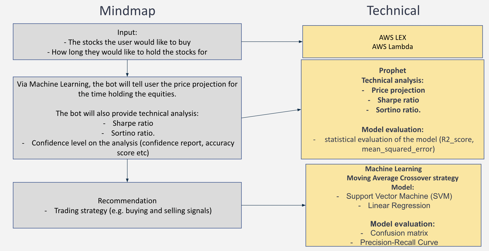

# Robo Advisor for Trading equities 

## Overview

### This robo advisor helps individuals with trading equities. Some features of this robo advisors are:

### - Interactions with the users 
### - Future stock prices forecast 
### - Provide technical analysis about the stock performance and the risks (Sharpe ratios & Sortino Ratio)  
### - Recommendations which includes trading strategies 

 

### An overview of the project: 

  

---

 

## User instruction

 

### 1. Access AWS LEX bots 

### The user will navigate into this interface

  

 

### 2. Input stock and holding period 

### User will tell the bot about their stock of interest and holding period:  

  

**Note:** 
- The user must give **stock code** not the stock name. 
- The bot will produce price forecast for **a maximum of 3 months** worth of data. 

 

### 3. View results 

### The stock performance forecast: 

  

### Technical analysis (Sharpe Ratio & Sortino Ratio): 

  

### Sharpe Ratio: 

It gives insights about risk-adjusted performance of the stock. The mathematical expression is stock return rate minus risk free asset return rate, then divided by the total standard deviation of the stock return. 

For more information about Sharpe Ratio, visit: https://www.investopedia.com/terms/s/sharperatio.asp
 

### Sortino ratio: 

Sortino ratio also gives insights about the risk-adjusted performance of the stocks. While it is very similar with Sharpe Ratio, the difference is that Sortino Ratio uses the **downside standard deviation** rather than total standard deviation like Sharpe Ratio. 

**For more information about Sortino Ratio, visit: https://www.investopedia.com/terms/s/sortinoratio.asp. 

### Confidence level on the model

  

 

### Installation guide: 

--- 
 

## Example: 
 

> ### ***Sam wants to invest in APPLE (stock code: AAPL) and he wants to hold the stock for 3 months. As an investor, Sam would like to get a good understanding about his investment idea. Sam would like to know th following:***
>  

> ### 1. What is the investment return after 12 months? 
> ### 2. How confident is robo advisor with the suggested return?  
> ### 3. How are the risks?  
> ### 4. Is there a way to improve the investment return results?
>  

> ###             ***The robo advisor can answer ALL!*** 

 

### Step 1: Input stock code and holding period to Robo Advisor. 

### Step 2: View 