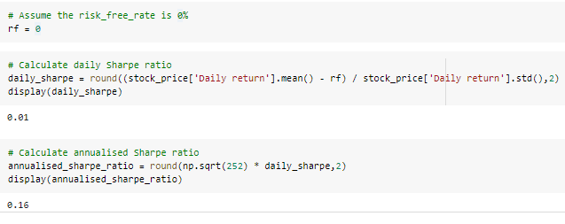

# Robo Advisor for Trading equities 

## Overview

### This robo advisor helps individuals with trading equities. Some features of this robo advisors are:

### - Interactions with the users 
### - Future stock prices forecast 
### - Provide technical analysis about the stock performance and the risks (Sharpe ratios & Sortino Ratio)  
### - Recommendations which includes trading strategies 

 

### An overview of the project: 

---

 

## User instruction

 

### 1. Access AWS LEX bots 

### The user will navigate into this interface

  

 

### 2. Input stock and holding period 

### User will tell the bot about their stock of interest and holding period:  

  

**Note:** 
- The user must give **stock code** not the stock name. 
- The bot will produce price forecast for **a maximum of 3 months** worth of data. 

 

### 3. View results 

### The stock performance forecast: 

  

### Using Moving average crossover trading algorithm: 

  

 

## Installation guide: 

***Hvplot***

conda install -c pyviz hvplot

Source: https://hvplot.holoviz.org/getting_started/installation.html

 

***Scikit-learn***

pip install -U scikit-learn

Source: https://scikit-learn.org/stable/install.html

 

***Tensor Flow***

1. pip install --upgrade pip

2. pip install tensorflow

3. pip install tf-nightly

Source: https://www.tensorflow.org/install

 

***Yahoo Finance***

!pip install yfinance

Source: https://blog.quantinsti.com/historical-market-data-python-api/

***Prophet***

python -m pip install prophet
 

Source: https://facebook.github.io/prophet/docs/installation.html 

--- 
 

## Example: 
 

> ### ***Sam wants to invest in APPLE (stock code: AAPL) and he wants to hold the stock for 3 months. As an investor, Sam would like to get a good understanding about his investment idea. Sam would like to know th following:***
>  

> ### 1. What is the investment return after 3 months?  
> ### 2. How are the risks?  
> ### 3. Is there a way to improve the investment return results?
> ### 4. How confident is robo advisor with the suggested return? 
>  

> ###             ***The robo advisor can answer ALL!*** 

 

After following through the user instruction: 

  

 

### ***1. What is the investment return after 3 months?*** 

At 95 % confidence, Sam will be expecting a range of return between 4.18 % to 4.87 %. 

 

### ***2. How are the risks?***  

There are few satistics the user can reference for risks. They are Sharpe Ratio and Sortino Ratio.

 

### Sharpe Ratio: 

It gives insights about risk-adjusted performance of the stock. The mathematical expression is stock return rate minus risk free asset return rate, then divided by the total standard deviation of the stock return. 

For more information about Sharpe Ratio, visit: https://www.investopedia.com/terms/s/sharperatio.asp

 

### Sortino ratio: 

Sortino ratio also gives insights about the risk-adjusted performance of the stocks. While it is very similar with Sharpe Ratio, the difference is that Sortino Ratio uses the **downside standard deviation** rather than total standard deviation like Sharpe Ratio. 

**For more information about Sortino Ratio, visit: https://www.investopedia.com/terms/s/sortinoratio.asp. 

 

### ***3. Is there a way to improve the investment return results?***

Trading Advisor uses machine learning learning models to develop trading strategies with Moving Average Cross Over Strategy, Sam can increase return to 20 %. 

 

### ***4. How confident is robo advisor with the suggested return?***

 

For ***Prophet***, the result is based on 95 % confidence rate. TRading advisor also provides the range on possible return. By judging the size of the range of return, Sam is informed about the reliability of the robo. 

 

### Prophet, the light blue shaded area represent the range of the possible return.

 

For ***machine learning model***, the project includes confusion matrix of the models used and the Precision-Recall curve. Via viewing these statistics, Sam can make informed decision abou whether he should adapt the trading strategy. 
 

### ***Precision-Recall Curve (not learnt in class):***

  

In this case, the Precision-Recall Curve is a linear line. 

 

> 'The precision-recall curve shows the tradeoff between precision and recall for different threshold. A high area under the curve represents both high recall and high precision, where high precision relates to a low false positive rate, and high recall relates to a low false negative rate. High scores for both show that the classifier is returning accurate results (high precision), as well as returning a majority of all positive results (high recall).' - Scikit-learnt 

Source: https://scikit-learn.org/stable/auto_examples/model_selection/plot_precision_recall.html#:~:text=The%20precision%2Drecall%20curve%20shows,a%20low%20false%20negative%20rate.

### Confusion matrix: 

The matrix compares the actual target values with those predicted by the machine learning model. Two models were used in this project and thet areL Supported Vector Machine (SVM) and Linear Regression. 

Confusion matrix for SVM model:

Confusion matrix for Linear Regression: 

Notice the recall ratio is 0.5 and the precision is 0.24 for both models. This suggest Sam needs to be cautious when taking the trading advice if using SVM and Linear Regression model for trading strategies. 
